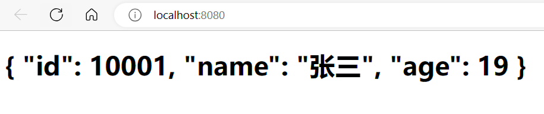
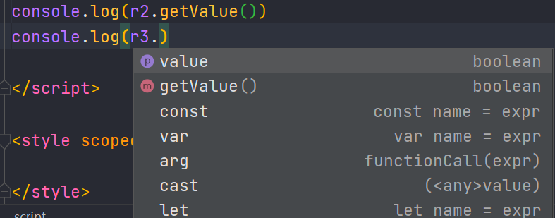
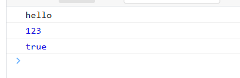
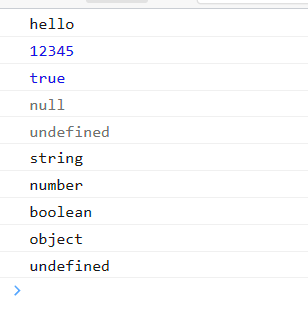
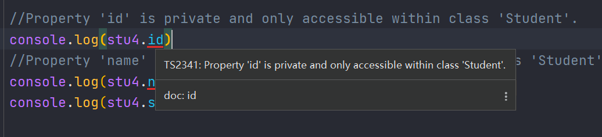
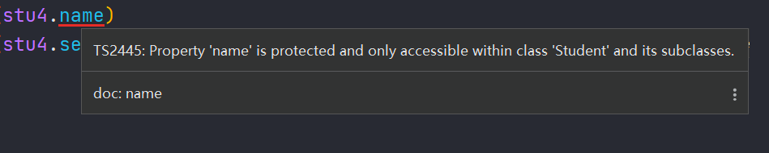
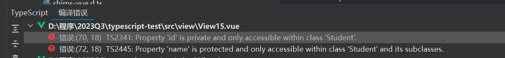

<h1 style="color:skyblue;text-align:center">TypeScript学习笔记</h1>


# TypeScript

## 概述

TypeScript是微软开发的一个开源的编程语言，通过在JavaScript的基础上添加静态类型定义构建而成。TypeScript通过TypeScript编译器或Babel转译为JavaScript代码，可运行在任何浏览器，任何操作系统。

TypeScript 起源于使用JavaScript开发的大型项目 。由于JavaScript语言本身的局限性，难以胜任大型项目的开发和维护。因此微软开发了TypeScript ，使得其能够胜任大型项目的开发。

TypeScript可以在任何浏览器运行、任何计算机和任何操作系统上运行，并且是开源的


TypeScript与js相比的优势：

* TypeScript工具使重构更变的容易、快捷。
* TypeScript 引入了 JavaScript 中没有的“类”概念。
* TypeScript 中引入了模块的概念，可以把声明、数据、函数和类封装在模块中
* 类型安全功能能在编码期间检测错误，这为开发人员创建了一个更高效的编码和调试过程。


## 官网

网站首页：https://www.tslang.cn/index.html

文档地址：https://www.tslang.cn/docs/home.html


## 安装

npm全局安装：

```sh
npm install -g typescript
```


也可以指定版本：

```sh
npm install -g typescript@4.1.5
```


```sh
PS C:\Users\mao\Desktop> npm install -g typescript@4.1.5
C:\Users\mao\AppData\Roaming\npm\tsc -> C:\Users\mao\AppData\Roaming\npm\node_modules\typescript\bin\tsc
C:\Users\mao\AppData\Roaming\npm\tsserver -> C:\Users\mao\AppData\Roaming\npm\node_modules\typescript\bin\tsserver
+ typescript@4.1.5
updated 1 package in 10.618s
PS C:\Users\mao\Desktop> tsc -v
Version 4.1.5
PS C:\Users\mao\Desktop>
```


```sh
PS C:\Users\mao\Desktop> tsc --help
Version 4.1.5
Syntax:   tsc [options] [file...]

Examples: tsc hello.ts
          tsc --outFile file.js file.ts
          tsc @args.txt
          tsc --build tsconfig.json

Options:
 -h, --help                                         Print this message.
 -w, --watch                                        Watch input files.
 --pretty                                           Stylize errors and messages using color and context (experimental).
 --all                                              Show all compiler options.
 -v, --version                                      Print the compiler's version.
 --init                                             Initializes a TypeScript project and creates a tsconfig.json file.
 -p FILE OR DIRECTORY, --project FILE OR DIRECTORY  Compile the project given the path to its configuration file, or to a folder with a 'tsconfig.json'.
 -b, --build                                        Build one or more projects and their dependencies, if out of date
 -t VERSION, --target VERSION                       Specify ECMAScript target version: 'ES3' (default), 'ES5', 'ES2015', 'ES2016', 'ES2017', 'ES2018', 'ES2019', 'ES2020', or 'ESNEXT'.
 -m KIND, --module KIND                             Specify module code generation: 'none', 'commonjs', 'amd', 'system', 'umd', 'es2015', 'es2020', or 'ESNext'.
 --lib                                              Specify library files to be included in the compilation.
                                                      'es5' 'es6' 'es2015' 'es7' 'es2016' 'es2017' 'es2018' 'es2019' 'es2020' 'esnext' 'dom' 'dom.iterable' 'webworker' 'webworker.importscripts' 'webworker.iterable' 'scripthost' 'es2015.core' 'es2015.collection' 'es2015.generator' 'es2015.iterable' 'es2015.promise' 'es2015.proxy' 'es2015.reflect' 'es2015.symbol' 'es2015.symbol.wellknown' 'es2016.array.include' 'es2017.object' 'es2017.sharedmemory' 'es2017.string' 'es2017.intl' 'es2017.typedarrays' 'es2018.asyncgenerator' 'es2018.asynciterable' 'es2018.intl' 'es2018.promise' 'es2018.regexp' 'es2019.array' 'es2019.object' 'es2019.string' 'es2019.symbol' 'es2020.bigint' 'es2020.promise' 'es2020.sharedmemory' 'es2020.string' 'es2020.symbol.wellknown' 'es2020.intl' 'esnext.array' 'esnext.symbol' 'esnext.asynciterable' 'esnext.intl' 'esnext.bigint' 'esnext.string' 'esnext.promise' 'esnext.weakref'
 --allowJs                                          Allow javascript files to be compiled.
 --jsx KIND                                         Specify JSX code generation: 'preserve', 'react-native', or 'react'.
 -d, --declaration                                  Generates corresponding '.d.ts' file.
 --declarationMap                                   Generates a sourcemap for each corresponding '.d.ts' file.
 --sourceMap                                        Generates corresponding '.map' file.
 --outFile FILE                                     Concatenate and emit output to single file.
 --outDir DIRECTORY                                 Redirect output structure to the directory.
 --removeComments                                   Do not emit comments to output.
 --noEmit                                           Do not emit outputs.
 --strict                                           Enable all strict type-checking options.
 --noImplicitAny                                    Raise error on expressions and declarations with an implied 'any' type.
 --strictNullChecks                                 Enable strict null checks.
 --strictFunctionTypes                              Enable strict checking of function types.
 --strictBindCallApply                              Enable strict 'bind', 'call', and 'apply' methods on functions.
 --strictPropertyInitialization                     Enable strict checking of property initialization in classes.
 --noImplicitThis                                   Raise error on 'this' expressions with an implied 'any' type.
 --alwaysStrict                                     Parse in strict mode and emit "use strict" for each source file.
 --noUnusedLocals                                   Report errors on unused locals.
 --noUnusedParameters                               Report errors on unused parameters.
 --noImplicitReturns                                Report error when not all code paths in function return a value.
 --noFallthroughCasesInSwitch                       Report errors for fallthrough cases in switch statement.
 --types                                            Type declaration files to be included in compilation.
 --esModuleInterop                                  Enables emit interoperability between CommonJS and ES Modules via creation of namespace objects for all imports. Implies 'allowSyntheticDefaultImports'.
 @<file>                                            Insert command line options and files from a file.
PS C:\Users\mao\Desktop>
```


## 动态类型的问题

js 属于动态类型语言


如下一个函数：

```js
function test(obj) {    
}
```


传递过去的参数可能是一个字符串：

```js
test('hello, world')
```

也可能是一个对象：

```js
test({a:1,b:2})
```

也有可能是个函数：

```sh
test(()=>{})
```


obj 类型不确定，就给后期使用者带来了麻烦，一旦参数传不对，代码可能出现问题


动态类型是在代码运行时才知道是什么

静态类型是在代码运行前，就对它的行为做出预测


## 在Vue中使用ts

全新项目：使用vue cli脚手架工具创建vue项目时，勾选 ts

已有项目：添加vue官方配置的ts适配插件，使用@vue/cli 安装 ts插件

```sh
vue add @vue/typescript
```


或者手动安装：

```sh
npm install ts-loader typescript tslint tslint-loader tslint-config-standard --save-dev
```

```sh
npm install vue-class-component vue-property-decorator --save
```


* vue-class-component：扩展vue支持typescript，将原有的vue语法通过声明的方式来支持ts
* vue-property-decorator：基于vue-class-component扩展更多装饰器
* ts-loader：让webpack能够识别ts文件
* tslint-loader：tslint用来约束文件编码
* tslint-config-standard： tslint 配置 standard风格的约束


在vue中使用要加上`lang="ts"`

```vue
<template>

</template>

<script lang="ts">
export default {
  name: "View1",
}
</script>

<style scoped>

</style>
```


## 入门

输出helloworld，并打印显示helloworld

```vue
<template>
  <div>
    <h1>{{ str }}</h1>
  </div>
</template>

<script setup lang="ts">

const str: string = 'hello world';

function hello(str: string)
{
  console.log(str);
}

hello(str);


</script>

<style scoped>

</style>
```


用 interface 定义用户类型：

```vue
<template>
  <div>
    <h1>{{ user }}</h1>
  </div>
</template>

<script setup lang="ts">
interface User
{
  id: number
  name: string,
  age: number,
}

function printUser(user: User): void
{
  console.log("user.id=" + user.id)
  console.log("user.name=" + user.name)
  console.log("user.age=" + user.age)
}

const user: User = {
  id: 10001,
  name: '张三',
  age: 19
}

printUser(user);

</script>

<style scoped>

</style>

```





## 类型


|    类型     |                  例                   |             备注             |
| :---------: | :-----------------------------------: | :--------------------------: |
| 字符串类型  |                string                 |                              |
|  数字类型   |                number                 |                              |
|  布尔类型   |                boolean                |                              |
|  数组类型   | number[],string[], boolean[] 依此类推 |                              |
|  任意类型   |                  any                  | 相当于又回到了没有类型的时代 |
|  复杂类型   |           type 与 interface           |                              |
|  函数类型   |              () => void               | 对函数的参数和返回值进行说明 |
| 字面量类型  |             "a"\|"b"\|"c"             |     限制变量或参数的取值     |
| nullish类型 |           null 与 undefined           |                              |
|    泛型     |      `<T>`，`<T extends 父类型>`      |                              |


## 类型标注位置

### 标注变量

```typescript
let message: string = 'hello,world'
```


一般可以省略，因为可以根据后面的字面量推断出前面变量类型

```typescript
let message = 'hello,world'
```


### 标注参数

```typescript
function test(name: string) {
    
}
```


### 标注返回值

```vue
<template>

</template>

<script lang="ts" setup>
function add(a: number, b: number): number
{
  return a + b;
}

console.log(add(1, 2))

</script>

<style scoped>

</style>
```


## 复杂类型

### type

```vue
<template>

</template>

<script lang="ts" setup>

type Student = {
  id: number,
  name: string,
  sex: string,
  age: number
}
const student1: Student = {id: 10001, name: "张三", sex: "男", age: 19};
//报错，缺少age
const student2: Student = {id: 10001, name: "张三", sex: "男"};
//报错，多了address
const student3: Student = {id: 10001, name: "张三", sex: "男", age: 19, address: "中国"};


console.log(student1);
console.log(student2);
console.log(student3);

</script>

<style scoped>

</style>
```


### interface

和type区别在于，少了一个等号

```vue
<template>

</template>

<script lang="ts" setup>

interface Student
{
  id: number,
  name: string,
  sex: string,
  age: number
}

const student1: Student = {id: 10001, name: "张三", sex: "男", age: 19};
//报错，缺少age
const student2: Student = {id: 10001, name: "张三", sex: "男"};
//报错，多了address
const student3: Student = {id: 10001, name: "张三", sex: "男", age: 19, address: "中国"};


console.log(student1);
console.log(student2);
console.log(student3);

</script>

<style scoped>

</style>
```


### 可选属性

如果需要某个属性可选，可以用下面的语法

```vue
<template>

</template>

<script lang="ts" setup>

interface Student
{
  id: number,
  name: string,
  sex: string,
  age?: number
}

const student1: Student = {id: 10001, name: "张三", sex: "男", age: 19};
//并不会报错，缺少age，但是会出现undefined
const student2: Student = {id: 10001, name: "张三", sex: "男"};
console.log(student1);
console.log(student2);
console.log(student2.age)

</script>

<style scoped>

</style>

```


### 鸭子类型

```vue
<template>

</template>

<script lang="ts" setup>

interface Student
{
  id: number,
  name: string,
  sex: string,
  age: number
}

const student1: Student = {id: 10001, name: "张三", sex: "男", age: 19};

//报错，多了address
//const student3: Student = {id: 10001, name: "张三", sex: "男", age: 19, address: "中国"};

const student3 = {id: 10001, name: "张三", sex: "男", age: 19, address: "中国"};
//鸭子类型，student3并没有声明类型为Student，但它与 Student 类型有一样的属性，也可以被当作是 Student 类型

console.log(student1);
console.log(student3);

</script>

<style scoped>

</style>
```

student3并没有声明类型为Student，但它与 Student 类型有一样的属性，也可以被当作是 Student 类型


## 方法类型

interface中包含方法（函数）


```vue
<template>
  <div>
    <h2>{{ user }}</h2>
  </div>
</template>

<script lang="ts" setup>

import {onBeforeMount, onMounted} from "vue";

interface User
{
  id: number,
  name: string,
  age: number,

  getName(): string

  getAgeString(): string

  setName(name: string): void
}

const user: User = {
  id: 10002,
  name: "张三",
  age: 12,
  getName(): string
  {
    return this.name
  },
  getAgeString(): string
  {
    if (this.age < 0 || this.age > 120)
    {
      return "年龄输入错误"
    }
    if (this.age < 18)
    {
      return "未成年";
    }
    if (this.age < 30)
    {
      return "青年"
    }
    if (this.age < 60)
    {
      return "中年"
    }
    return "老年"
  },
  setName(name: string)
  {
    this.name = name;
  }
}

onBeforeMount(()=>
{
  console.log(user.getName())
  console.log(user.getAgeString())
  user.setName("李四")
  console.log(user.getName())
})

</script>

<style scoped>

</style>
```


## 字面量类型

```vue
<template>
  <div>

  </div>
</template>

<script lang="ts" setup>

/**
 * 打印字符串到控制台
 * @param str 字符串
 * @param alignment 对齐方式，只能取值left、right和center
 */
function print(str: string, alignment: "left" | "right" | "center")
{
  console.log(str, alignment)
}

print("hello", "left")
print("hello", "right")
print("hello", "center")
//以下报错：Argument of type '"131412351"' is not assignable to parameter of type '"left" | "right" | "center"'
print("hello","131412351")


</script>

<style scoped>

</style>
```


## nullish 类型

在冒号前面加一个问号，表示字段可以为空

```vue
<template>

</template>

<script lang="ts" setup>

interface StudentV1
{
  id: number,
  name: string,
  sex: string,
  age: number
}

interface StudentV2
{
  id: number,
  name: string,
  sex?: string,
  age?: number
}

//Property 'age' is missing in type '{ id: number; name: string; sex: string; }' but required in type 'StudentV1'.
const studentV1: StudentV1 = {id: 10001, name: "张三", sex: "男"};
//Type 'undefined' is not assignable to type 'number'.
const student2V1: StudentV1 = {id: 10001, name: "张三", sex: "男", age: undefined};
//并不会报错
const studentV2: StudentV2 = {id: 10001, name: "张三"};
const student2V2: StudentV2 = {id: 10001, name: "张三",sex:undefined};

console.log(studentV1)
console.log(studentV2)
console.log(student2V1)
console.log(student2V2)

</script>

<style scoped>

</style>
```


```vue
<template>

</template>

<script lang="ts" setup>

function toUpperCase(str?: string | null): string
{
  return str?.toUpperCase() || "无效字符串"
}

function toUpperCase2(str: string): string
{
  return str.toUpperCase()
}

console.log(toUpperCase("hello"))
console.log(toUpperCase(null))
console.log(toUpperCase())

console.log(toUpperCase2("hello2"))
//Argument of type 'null' is not assignable to parameter of type 'string'.
console.log(toUpperCase2(null))
//Expected 1 arguments, but got 0.
console.log(toUpperCase2())

</script>

<style scoped>

</style>
```


## 泛型

下面的几个类型声明显然有一定的相似性

```typescript
interface RefString {
  value: string
}

interface RefNumber {
  value: number
}

interface RefBoolean {
  value: boolean
}

const r1: RefString = { value: 'hello' }
const r2: RefNumber = { value: 123 }
const r3: RefBoolean = { value: true }
```


可以改进为：

```vue
<template>

</template>

<script lang="ts" setup>

interface Ref<T>
{
  value: T,

  /**
   * 得到value值
   */
  getValue(): T
}

const r1: Ref<string> = {
  value: 'hello', getValue()
  {
    return this.value
  }
}
const r2: Ref<number> = {
  value: 123, getValue()
  {
    return this.value
  }
}
const r3: Ref<boolean> = {
  value: true, getValue()
  {
    return this.value
  }
}

console.log(r1.getValue())
console.log(r2.getValue())
console.log(r3.getValue())

</script>

<style scoped>

</style>
```








函数定义也支持泛型：

```vue
<template>

</template>

<script lang="ts" setup>

function ref<T>(arg: T): T
{
  return arg;
}

console.log(ref("hello"))
console.log(ref(12345))
console.log(ref(true))
console.log(ref(null))
console.log(ref(undefined))

console.log(typeof ref("hello"))
console.log(typeof ref(12345))
console.log(typeof ref(true))
console.log(typeof ref(null))
console.log(typeof ref(undefined))

</script>

<style scoped>

</style>
```





## 类

### 基本语法

```vue
<template>
  <div>
    <h2>{{stu1}}</h2>
    <h2>{{stu2}}</h2>
    <h2>{{stu3}}</h2>
    <h2>{{stu4}}</h2>


  </div>
</template>

<script setup lang="ts">

/**
 * 学生类
 */
class Student
{
  /**
   * id
   */
  id: number;
  /**
   * 姓名
   */
  name: string;
  /**
   * 性别
   */
  sex: string;


  /**
   * 无参构造方法
   */
  constructor();
  /**
   *
   * @param id 学生学号
   */
  constructor(id: number);
  /**
   *
   * @param id 学生学号
   * @param name 姓名
   */
  constructor(id: number, name: string);
  /**
   *
   * @param id 学生学号
   * @param name 姓名
   * @param sex 性别
   */
  constructor(id: number, name: string, sex: string);
  /**
   *
   * @param id 学生学号
   * @param name 姓名
   * @param sex 性别
   */
  constructor(id?: number, name?: string, sex?: string)
  {
    console.log("构造方法被调用了")
    this.id = id ? id : 10001
    this.name = name ? name : "张三"
    this.sex = sex ? sex : "男"
  }
}

const stu1: Student = new Student()
console.log(stu1)

const stu2: Student = new Student(102222)
console.log(stu2)

const stu3: Student = new Student(102223, "李四")
console.log(stu3)

const stu4: Student = new Student(102224, "王五", '女')
console.log(stu4)

console.log(stu4.name)

</script>

<style scoped>

</style>

```


js 中的 class，并不等价于 java 中的 class，它还是基于原型实现的


### 访问修饰符

有三类：

* public
* protected
* private


默认为 public，可以自由的访问程序里定义的成员

当成员被标记成 private时，它就不能在声明它的类的外部访问

protected修饰符与 private修饰符的行为很相似，但有一点不同， protected成员在派生类中仍然可以访问


可以参考java


```vue
<template>
  <div>
    <h2>{{ stu4 }}</h2>
  </div>
</template>

<script setup lang="ts">

/**
 * 学生类
 */
class Student
{
  /**
   * id
   */
  private id: number;
  /**
   * 姓名
   */
  protected name: string;
  /**
   * 性别
   */
  public sex: string;


  /**
   * 无参构造方法
   */
  constructor();
  /**
   *
   * @param id 学生学号
   */
  constructor(id: number);
  /**
   *
   * @param id 学生学号
   * @param name 姓名
   */
  constructor(id: number, name: string);
  /**
   *
   * @param id 学生学号
   * @param name 姓名
   * @param sex 性别
   */
  constructor(id: number, name: string, sex: string);
  /**
   *
   * @param id 学生学号
   * @param name 姓名
   * @param sex 性别
   */
  constructor(id?: number, name?: string, sex?: string)
  {
    console.log("构造方法被调用了")
    this.id = id ? id : 10001
    this.name = name ? name : "张三"
    this.sex = sex ? sex : "男"
  }
}

const stu4: Student = new Student(102224, "王五", '女')

console.log(stu4)

//Property 'id' is private and only accessible within class 'Student'.
console.log(stu4.id)
//Property 'name' is protected and only accessible within class 'Student' and its subclasses.
console.log(stu4.name)
console.log(stu4.sex)

</script>

<style scoped>

</style>
```











### 只读属性

readonly 是 typescript 特有的，表示该属性只读

```vue
<template>

</template>

<script lang="ts" setup>

class User
{
  /**
   * 用户编号，只读
   */
  readonly id: number;
  /**
   * 用户名称
   */
  name: string | undefined;

  constructor()
  {
    this.id = 10001;
  }
}

const user: User = new User();
//Cannot assign to 'id' because it is a read-only property.
user.id = 10002;
user.name = "张三";

console.log(user.id)
console.log(user.name)

</script>

<style scoped>

</style>
```


### 方法

```vue
<template>

</template>

<script lang="ts" setup>

class User
{
  /**
   * 用户编号，只读
   */
  readonly id: number;
  /**
   * 用户名称
   */
  name: string | undefined;

  constructor()
  {
    this.id = 10001;
  }

  /**
   * 转字符串
   */
  toString()
  {
    return "用户编号：" + this.id + ",用户名称：" + this.name
  }

  /**
   * 转json
   */
  toJson()
  {
    return JSON.stringify(this);
  }

}

const user: User = new User();
user.name = "张三";

console.log(user.id)
console.log(user.name)

console.log(user.toString())
console.log(user.toJson())

</script>

<style scoped>

</style>
```


### get和set

```vue
<template>

</template>

<script setup lang="ts">

class Student
{
  private _id: number;
  private _name: string;

  get name(): string
  {
    console.log("调用name 的get方法")
    return this._name;
  }

  set name(value: string)
  {
    console.log("调用name 的set方法")
    this._name = value;
  }

  get id(): number
  {
    console.log("调用id 的get方法")

    return this._id;
  }

  set id(value: number)
  {
    console.log("调用id 的set方法")
    this._id = value;
  }

  constructor()
  {
    this._id = 10001
    this._name = "";
  }
}

const student: Student = new Student();

//Property '_id' is private and only accessible within class 'Student'.
//console.log(student._id)
//Property '_name' is private and only accessible within class 'Student'.
//console.log(student._name)

student.id = 99999;
student.name = "李四"

console.log(student.id)
console.log(student.name)

</script>

<style scoped>

</style>
```


### 类与接口

